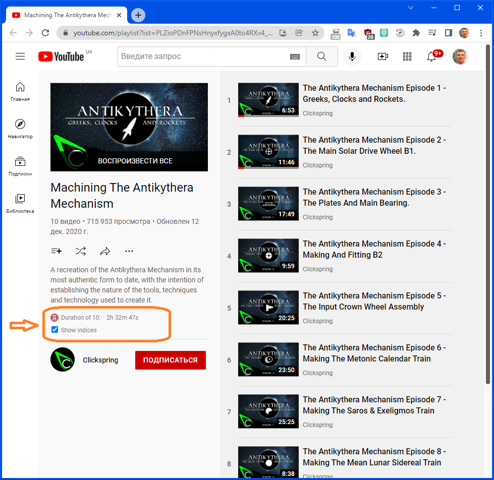

# PlaylistDuration
Playlist Duration Chrome Extension for YouTube - Shows the total duration of all videos on the playlist page

Based on extension [Общее время youtube плейлиста](https://chrome.google.com/webstore/detail/%D0%BE%D0%B1%D1%89%D0%B5%D0%B5-%D0%B2%D1%80%D0%B5%D0%BC%D1%8F-youtube-%D0%BF%D0%BB%D0%B5%D0%B9%D0%BB/iijhpmeejoegjpicbohaemappolpihea)

Supports new YouTube design (Polymer design). The original extension only works on the old design.
Also added automatic recalculation when removing a video from the playlist or loading a new part of a large playlist.

Note:
The extension can only calculate the duration of the videos that are visible on the screen. YouTube does not show all videos of playlist if their number is more than 100, but dynamically loads parts of the playlist in portions of 100. 
The extension recalculates the total duration each time a new part of the playlist is loaded.

You also can recalculate total duration manually by clicking the label with total duration.